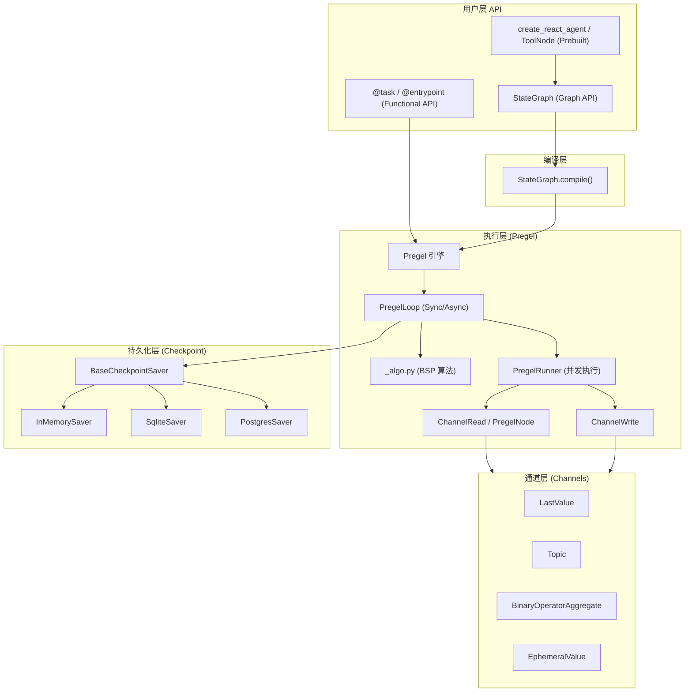

# 代码架构：LangGraph

## 整体架构概述

LangGraph 采用**分层插件化架构**：

1. **用户层**：提供两种风格的 API——声明式的 `StateGraph`（图 API）和命令式的 `@task`/`@entrypoint`（Functional API）。
2. **编译层**：`StateGraph.compile()` 将图定义转换为底层的 `Pregel` 执行计划。
3. **执行层**：`Pregel` 引擎基于 BSP（Bulk Synchronous Parallel）模型，通过 `PregelLoop` 驱动节点（actors）在通道（channels）间通信。
4. **持久化层**：`BaseCheckpointSaver` 抽象支持内存、SQLite、PostgreSQL 等多种后端，实现状态快照和恢复。

## 架构图



## 模块划分

| 模块名 | 职责 | 对外接口 | 依赖模块 |
|--------|------|----------|----------|
| `langgraph.graph` | 图构建：定义节点、边、状态模式 | `StateGraph`, `MessageGraph`, `add_node()`, `add_edge()`, `compile()` | `langgraph.pregel`, `langgraph.channels`, `langgraph.managed` |
| `langgraph.pregel` | 执行引擎：BSP 循环、任务调度、Checkpoint 管理 | `Pregel`, `NodeBuilder`, `PregelLoop`, `PregelRunner` | `langgraph.channels`, `langgraph.checkpoint.base`, `langchain-core` |
| `langgraph.channels` | 节点间通信通道的实现 | `BaseChannel`, `LastValue`, `Topic`, `BinaryOperatorAggregate` | `langgraph.errors` |
| `langgraph.managed` | 托管值生命周期管理（如 `RemainingSteps`） | `ManagedValueSpec`, `RemainingSteps` | `langgraph.channels` |
| `langgraph.func` | Functional API：将函数直接编译为 Pregel 图 | `@task`, `@entrypoint` | `langgraph.pregel` |
| `langgraph.prebuilt` | 高层预构建智能体组件 | `create_react_agent`, `ToolNode`, `tools_condition` | `langgraph.graph`, `langchain-core` |
| `langgraph.checkpoint` | Checkpoint 持久化抽象与内存实现 | `BaseCheckpointSaver`, `Checkpoint`, `InMemorySaver` | `langchain-core` |
| `langgraph.checkpoint.sqlite` | SQLite 持久化实现 | `SqliteSaver` | `langgraph.checkpoint` |
| `langgraph.checkpoint.postgres` | PostgreSQL 持久化实现 | `PostgresSaver`, `AsyncPostgresSaver` | `langgraph.checkpoint` |
| `langgraph_sdk` | REST API 交互 SDK | `LangGraphClient` | `httpx` |
| `langgraph_cli` | 命令行工具 | `langgraph` CLI | `click` / `typer` |

## 核心抽象与设计模式

### 核心类/接口

| 类/接口 | 职责 | 关系 |
|---------|------|------|
| `StateGraph` | 图构建器，定义状态模式、节点、边 | 组合 `StateNodeSpec`、`BranchSpec` |
| `CompiledStateGraph` | 编译后的可执行图 | 继承/包装 `Pregel` |
| `Pregel` | 执行引擎，管理 actors 和 channels | 组合 `PregelNode`、`BaseChannel`、`PregelLoop` |
| `PregelNode` | 图中的执行单元（actor） | 实现 LangChain `Runnable` 接口 |
| `BaseChannel` | 节点间通信通道的抽象 | 子类：`LastValue`、`Topic`、`BinaryOperatorAggregate` 等 |
| `BaseCheckpointSaver` | 状态持久化接口 | 子类：`InMemorySaver`、`SqliteSaver`、`PostgresSaver` |
| `PregelLoop` | 执行循环，维护 checkpoint 和任务状态 | 被 `Pregel` 调用，依赖 `_algo.py` |

### 使用的设计模式

- **构建器模式（Builder）**：`StateGraph` 通过链式调用 `add_node()`、`add_edge()` 构建图；`NodeBuilder` 用于底层 Pregel 节点组装。
- **策略模式（Strategy）**：`BaseChannel` 的不同子类实现了不同的状态更新策略（覆盖、追加、聚合、主题广播）。
- **状态模式（State）**：`PregelLoop` 维护 `"input"`、`"pending"`、`"done"`、`"interrupt_before"` 等状态，驱动执行流程。
- **模板方法模式（Template Method）**：`BaseCheckpointSaver` 定义持久化协议，具体后端实现 `get_tuple()`、`put()`、`put_writes()` 等方法。
- **观察者模式（Observer）**：通过 LangChain `CallbackManager` 实现执行过程中的事件流（stream、debug、tracing）。

## 外部集成

| 外部服务/库 | 用途 | 对接模块 | 协议/方式 |
|-------------|------|----------|-----------|
| `langchain-core` | Runnable 接口、消息模型、LLM 调用、回调管理 | 全库 | Python API |
| `pydantic` | 类型校验、动态模型生成 | `graph/state.py`、`_internal/_pydantic.py` | Python API |
| SQLite | Checkpoint 本地持久化 | `checkpoint-sqlite` | SQL / `sqlite3` |
| PostgreSQL | Checkpoint 生产级持久化 | `checkpoint-postgres` | SQL / `psycopg` |
| Redis | 缓存后端（可选） | `cache/redis` | Redis 协议 |
| LangSmith | 执行追踪与可观测性 | 通过 `langchain-core` Callbacks | HTTP API |
| LangGraph Server | 部署与远程调用 | `sdk-py` / `sdk-js` | REST API |

## 扩展点

LangGraph 提供了多个扩展点，允许在不修改核心代码的情况下添加新功能：

1. **自定义 Channel**：继承 `BaseChannel`，实现 `get()`、`update()`、`from_checkpoint()`，即可定义新的状态传播语义。
2. **自定义 Checkpoint Saver**：继承 `BaseCheckpointSaver`，实现 `get_tuple()`、`put()`、`put_writes()`、`alist()` 等，即可对接任意存储后端。
3. **自定义 Managed Value**：通过 `ManagedValueSpec` 和 `ManagedValueMapping`，可在节点中注入自动管理的运行时值（如 `RemainingSteps`）。
4. **自定义 Retry Policy**：通过 `RetryPolicy` 配置节点的重试策略（重试次数、退避、条件）。
5. **自定义 Stream Mode**：支持 `"values"`、`"updates"`、`"messages"`、`"custom"`、`"debug"` 等多种流式输出模式，且可通过 `StreamWriter` 在节点中发射自定义事件。
6. **Prebuilt 扩展**：`create_react_agent` 等高层 API 允许传入自定义的 `prompt`、`tools`、`checkpointer`，组合出不同的智能体行为。

## 模块依赖方向

```text
langgraph-checkpoint (base)
    ↑
    ├── langgraph-checkpoint-sqlite
    ├── langgraph-checkpoint-postgres
    ├── langgraph (core)
    │       ↑
    │       ├── langgraph-prebuilt
    │       ├── langgraph-sdk-py
    │       └── langgraph-cli
    │
    └── langgraph-prebuilt

langgraph-sdk-js (standalone)
```

- **无循环依赖**：底层 `checkpoint` 不依赖上层；`langgraph` 核心依赖 `checkpoint` 和 `langchain-core`；`prebuilt`、`sdk-py`、`cli` 均依赖 `langgraph` 核心。
- **注意**：`langgraph` 的 `pyproject.toml` 中声明了对 `langgraph-prebuilt` 的运行时依赖，这是为了用户安装 `langgraph` 时自动获得预构建组件，但代码层面 `langgraph` 核心并不直接导入 `prebuilt`。
